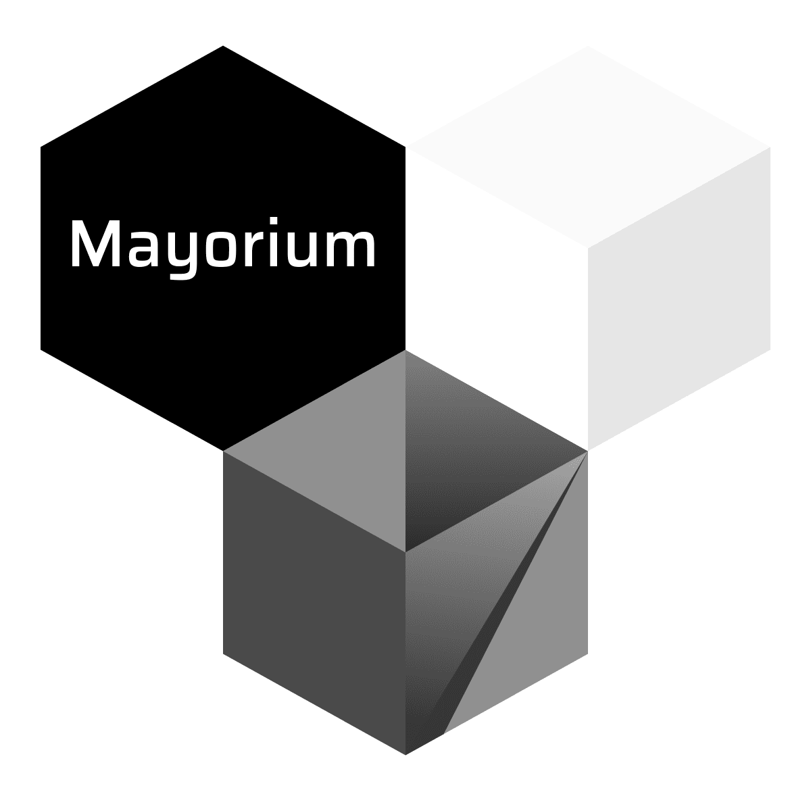

#  Repositorio del trabajo de inserción profesional (TIP) de  Mayorium

Alumno: Octavio Pompilio

### Motivación

Crear una plataforma e-commerce mayorista como alternativa al encierro por pandamia.

### Objetivo

Ofrecer servicio de simplificado de pedidos y un manejo de stock automatico.
